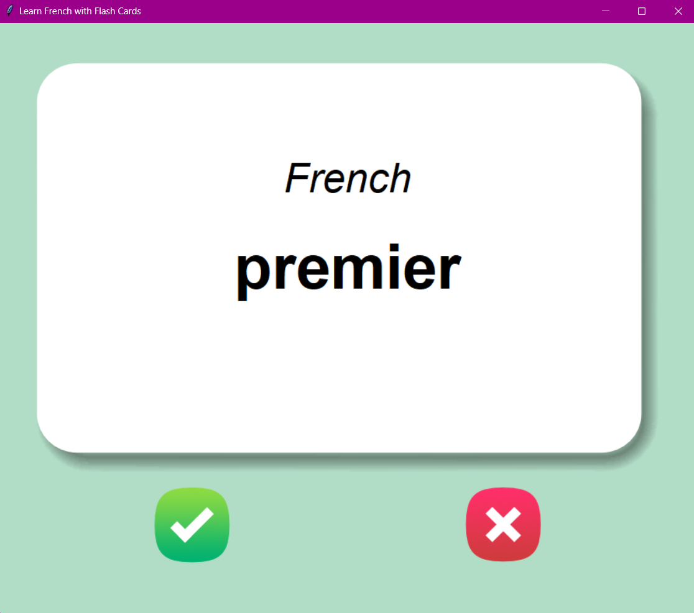

# Learn Languages with Flash Cards
Learn languages with flash cards thanks to this Python project. 
**Libraries**: tkinter, pandas  

 
 The project is part of [The Complete Python Pro Bootcamp](https://www.udemy.com/course/100-days-of-code) in which I enrolled in 2022. 

### Credits
>To know more about The App Brewery's courses visit <a href="https://www.appbrewery.co/">App Brewery</a>!
